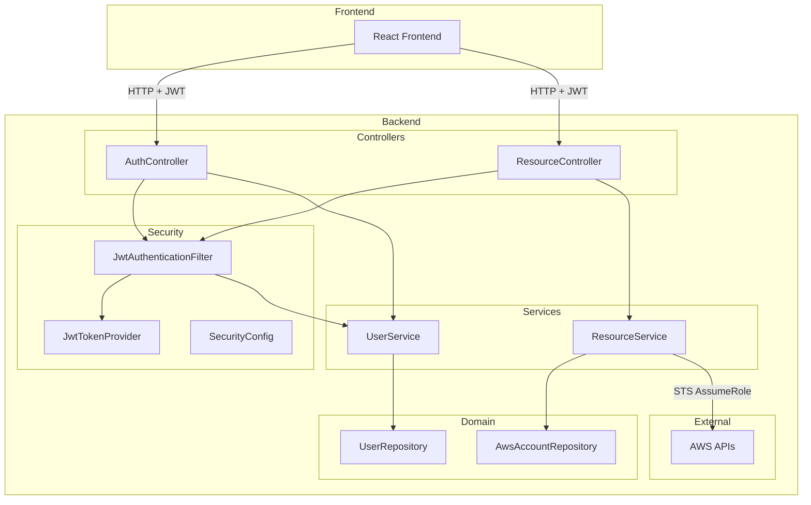

# Design Document: Auth and Resource API

## Overview

AWS Builder Hub 백엔드의 인증 시스템과 AWS 리소스 조회 API 설계 문서입니다. 이 시스템은 Spring Security와 JWT를 사용한 인증, AWS SDK를 통한 다중 계정 리소스 조회를 제공합니다.

## Architecture



## Components and Interfaces

### 1. Security Layer

#### JwtTokenProvider
JWT 토큰 생성 및 검증을 담당합니다.

```kotlin
interface JwtTokenProvider {
    fun generateToken(userId: Long, email: String, role: String): String
    fun getUserIdFromToken(token: String): Long
    fun getEmailFromToken(token: String): String
    fun getRoleFromToken(token: String): String
    fun validateToken(token: String): Boolean
}
```

#### JwtAuthenticationFilter
HTTP 요청에서 JWT 토큰을 추출하고 인증을 처리합니다.

```kotlin
class JwtAuthenticationFilter : OncePerRequestFilter {
    override fun doFilterInternal(
        request: HttpServletRequest,
        response: HttpServletResponse,
        filterChain: FilterChain
    )
    
    private fun resolveToken(request: HttpServletRequest): String?
}
```

### 2. Auth Controller

사용자 인증 관련 엔드포인트를 제공합니다.

```kotlin
@RestController
@RequestMapping("/api/v1/auth")
class AuthController {
    @PostMapping("/login")
    fun login(request: LoginRequest): ResponseEntity<AuthResponse>
    
    @PostMapping("/register")
    fun register(request: RegisterRequest): ResponseEntity<AuthResponse>
    
    @GetMapping("/me")
    fun getCurrentUser(principal: UserPrincipal): ResponseEntity<UserResponse>
}
```

### 3. Resource Controller

AWS 리소스 조회 엔드포인트를 제공합니다.

```kotlin
@RestController
@RequestMapping("/api/v1/resources")
class ResourceController {
    @GetMapping("/ec2")
    fun listEC2Instances(accountId: Long?, region: String?): List<EC2InstanceResponse>
    
    @GetMapping("/rds")
    fun listRDSInstances(accountId: Long?, region: String?): List<RDSInstanceResponse>
    
    @GetMapping("/s3")
    fun listS3Buckets(accountId: Long?): List<S3BucketResponse>
    
    @GetMapping("/vpc")
    fun listVPCs(accountId: Long?, region: String?): List<VPCResponse>
}
```

### 4. User Service

사용자 관리 비즈니스 로직을 담당합니다.

```kotlin
interface UserService {
    fun findById(id: Long): User?
    fun findByEmail(email: String): User?
    fun createUser(email: String, name: String, password: String?, role: UserRole): User
    fun validatePassword(user: User, rawPassword: String): Boolean
    fun updateUserRole(userId: Long, role: UserRole): User
    fun disableUser(userId: Long): User
}
```

### 5. Resource Service

AWS 리소스 조회 비즈니스 로직을 담당합니다.

```kotlin
interface ResourceService {
    fun listEC2Instances(accountId: Long?, region: String?): List<EC2Instance>
    fun listRDSInstances(accountId: Long?, region: String?): List<RDSInstance>
    fun listS3Buckets(accountId: Long?): List<S3Bucket>
    fun listVPCs(accountId: Long?, region: String?): List<VPC>
}
```

## Data Models

### User Entity

```kotlin
@Entity
@Table(name = "users")
class User(
    @Id @GeneratedValue(strategy = GenerationType.IDENTITY)
    val id: Long = 0,
    
    @Column(unique = true, nullable = false)
    val email: String,
    
    @Column(nullable = false)
    var name: String,
    
    @Column(nullable = true)
    var password: String? = null,
    
    @Enumerated(EnumType.STRING)
    var role: UserRole = UserRole.DEVELOPER,
    
    var oktaUserId: String? = null,
    var enabled: Boolean = true,
    val createdAt: LocalDateTime = LocalDateTime.now(),
    var updatedAt: LocalDateTime = LocalDateTime.now()
)

enum class UserRole {
    ADMIN,
    DEVELOPER
}
```

### AWS Account Entity

```kotlin
@Entity
@Table(name = "aws_accounts")
class AwsAccount(
    @Id @GeneratedValue(strategy = GenerationType.IDENTITY)
    val id: Long = 0,
    
    @Column(unique = true, nullable = false)
    val accountId: String,
    
    @Column(nullable = false)
    var accountName: String,
    
    @Column(nullable = false)
    var roleArn: String,
    
    var externalId: String? = null,
    var description: String? = null,
    
    @Enumerated(EnumType.STRING)
    var status: AwsAccountStatus = AwsAccountStatus.PENDING
)

enum class AwsAccountStatus {
    PENDING,
    VERIFIED,
    FAILED,
    DISABLED
}
```

### Resource DTOs

```kotlin
data class EC2Instance(
    val instanceId: String,
    val name: String?,
    val instanceType: String,
    val state: String,
    val publicIpAddress: String?,
    val privateIpAddress: String?,
    val availabilityZone: String?,
    val launchTime: Instant?,
    val accountId: String,
    val accountName: String,
    val region: String
)

data class RDSInstance(
    val dbInstanceIdentifier: String,
    val dbInstanceClass: String,
    val engine: String,
    val engineVersion: String?,
    val status: String,
    val endpoint: String?,
    val port: Int?,
    val availabilityZone: String?,
    val allocatedStorage: Int,
    val accountId: String,
    val accountName: String,
    val region: String
)

data class S3Bucket(
    val name: String,
    val creationDate: Instant?,
    val region: String?,
    val accountId: String,
    val accountName: String
)

data class VPC(
    val vpcId: String,
    val cidrBlock: String,
    val state: String,
    val isDefault: Boolean,
    val name: String?,
    val accountId: String,
    val accountName: String,
    val region: String
)
```

### Auth DTOs

```kotlin
data class LoginRequest(
    val username: String,
    val password: String
)

data class RegisterRequest(
    val email: String,
    val name: String,
    val password: String
)

data class AuthResponse(
    val accessToken: String,
    val expiresIn: Long,
    val user: UserResponse
)

data class UserResponse(
    val id: Long,
    val email: String,
    val name: String,
    val role: String
)
```

## Correctness Properties

*A property is a characteristic or behavior that should hold true across all valid executions of a system-essentially, a formal statement about what the system should do. Properties serve as the bridge between human-readable specifications and machine-verifiable correctness guarantees.*

### Property 1: JWT Token Round-Trip

*For any* 유효한 사용자 정보(userId, email, role), JWT 토큰을 생성한 후 해당 토큰에서 정보를 추출하면 원래 정보와 동일해야 한다.

**Validates: Requirements 2.5**

### Property 2: Password Encryption Verification

*For any* 평문 비밀번호, BCrypt로 암호화한 후 validatePassword로 검증하면 true를 반환해야 한다.

**Validates: Requirements 3.3**

### Property 3: New User Default Role

*For any* 새로 생성된 사용자(역할 미지정), 기본 역할은 DEVELOPER여야 한다.

**Validates: Requirements 3.4**

### Property 4: Valid Login Returns Token

*For any* 활성화된 사용자와 올바른 비밀번호, 로그인 시 유효한 JWT 토큰이 반환되어야 한다.

**Validates: Requirements 1.1, 1.5**

### Property 5: Token Contains Required Claims

*For any* 생성된 JWT 토큰, 토큰에는 userId, email, role 클레임이 포함되어야 한다.

**Validates: Requirements 1.5**

### Property 6: Account ID Filtering

*For any* 리소스 목록과 accountId 필터, 반환된 모든 리소스의 accountId는 필터 값과 일치해야 한다.

**Validates: Requirements 5.2, 6.2, 7.2, 8.2**

### Property 7: Region Filtering

*For any* 리소스 목록과 region 필터, 반환된 모든 리소스의 region은 필터 값과 일치해야 한다.

**Validates: Requirements 5.3, 6.3, 8.3**

### Property 8: Verified Accounts Only

*For any* 리소스 조회 요청, 사용되는 AWS 계정은 모두 VERIFIED 상태여야 한다.

**Validates: Requirements 9.3**

### Property 9: External ID Inclusion

*For any* External ID가 설정된 AWS 계정, AssumeRole 요청에 External ID가 포함되어야 한다.

**Validates: Requirements 9.2**

### Property 10: Role-Based Access Control

*For any* API 요청과 사용자 역할, ADMIN은 모든 API에 접근 가능하고, DEVELOPER는 리소스 조회 API에만 접근 가능해야 한다.

**Validates: Requirements 10.2, 10.3, 10.4**

## Error Handling

### Authentication Errors

| Error Case | HTTP Status | Response |
|------------|-------------|----------|
| 존재하지 않는 사용자 | 401 Unauthorized | `{"error": "Invalid credentials"}` |
| 잘못된 비밀번호 | 401 Unauthorized | `{"error": "Invalid credentials"}` |
| 비활성화된 사용자 | 401 Unauthorized | `{"error": "User is disabled"}` |
| 만료된 토큰 | 401 Unauthorized | `{"error": "Token expired"}` |
| 잘못된 토큰 | 401 Unauthorized | `{"error": "Invalid token"}` |
| 권한 없음 | 403 Forbidden | `{"error": "Access denied"}` |

### Registration Errors

| Error Case | HTTP Status | Response |
|------------|-------------|----------|
| 중복 이메일 | 409 Conflict | `{"error": "Email already exists"}` |
| 유효하지 않은 이메일 형식 | 400 Bad Request | `{"error": "Invalid email format"}` |

### Resource Errors

| Error Case | HTTP Status | Response |
|------------|-------------|----------|
| AWS API 실패 | 200 OK | 해당 계정/리전 제외한 결과 반환 |
| 계정 없음 | 200 OK | 빈 배열 반환 |

## Testing Strategy

### Unit Tests

단위 테스트는 개별 컴포넌트의 동작을 검증합니다.

- **JwtTokenProvider**: 토큰 생성, 검증, 클레임 추출
- **UserService**: 사용자 생성, 비밀번호 검증, 역할 관리
- **ResourceService**: 필터링 로직, 에러 처리

### Property-Based Tests

Property-based testing을 사용하여 correctness properties를 검증합니다.

- **Testing Framework**: Kotest (Kotlin property-based testing)
- **Minimum Iterations**: 100회 이상
- **Tag Format**: `Feature: auth-and-resource-api, Property N: {property_text}`

### Integration Tests

통합 테스트는 컴포넌트 간 상호작용을 검증합니다.

- **Auth Flow**: 로그인 → 토큰 발급 → 인증된 요청
- **Resource Flow**: 인증 → AWS 계정 조회 → 리소스 조회
- **RBAC**: 역할별 API 접근 권한

### Test Configuration

```kotlin
// build.gradle.kts
testImplementation("io.kotest:kotest-runner-junit5:5.8.0")
testImplementation("io.kotest:kotest-property:5.8.0")
testImplementation("io.kotest:kotest-assertions-core:5.8.0")
```
